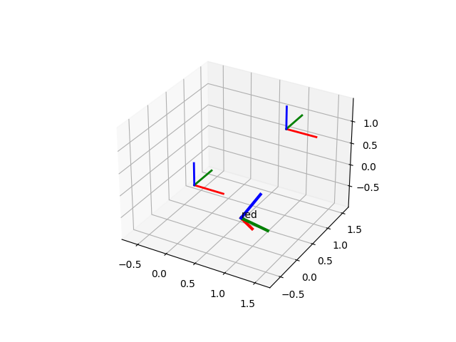

# Python Matplotlib Helper functions

Welcome to the home of Python Matplotlib Helper Functions – your one-stop repository for essential Python tools designed to enhance your plotting experience with Matplotlib. Here, we believe in the power of collaboration and community-driven development. Our goal is to curate a diverse collection of handy functions that cater to various scenarios, making data visualization effortless and enjoyable for everyone. We encourage all enthusiasts, like yourself, to actively participate and contribute their own valuable additions. Together, let's build a comprehensive library of useful helpers that will empower users to create stunning visualizations with ease. Don't hesitate to join us in this exciting journey of empowering Pythonistas and data enthusiasts alike!
© 2023 ChatGPT, All Rights Reserved. Unauthorized copying or potion brewing is strictly prohibited and may result in severe hexes and curses! 🧙‍♂️🚫🧪✨

"Disclaimer: The copyright notice above is meant to add a touch of whimsy and fun to our repository. While we do take the protection of intellectual property seriously, we don't intend for the notice to be legally binding. Enjoy our magical world of Matplotlib Helper Functions responsibly and unleash your creativity!"

## 3D_pose_plot
Helper function to plot pose as coordinate system with orientation. Something one often needs when debug plotting calculated poses.

find it in src/3D_pose_plot.py

**plotPose(ax, R, t, scale = np.array((1,1,1)), l_width=2, text = None)**
    plot an coordinate system to visualize Pose (R|t)
    
    ax      : matplotlib axes to plot on
    R       : Rotation as roation matrix
    t       : translation as np.array (1, 3)
    scale   : Scale as np.array (1, 3)
    l_width : linewidth of axis
    text    : Text written at origin

